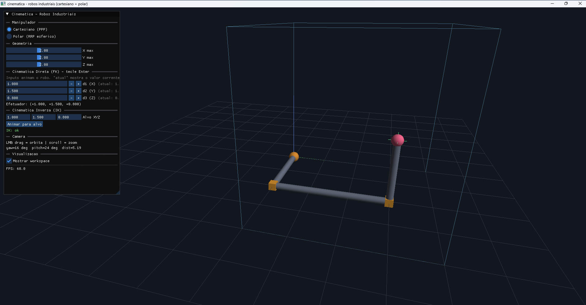
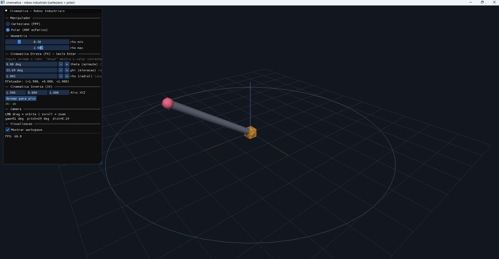

# cinematica-industrial

Simulação 3D OpenGL de **dois robôs industriais** — Cartesiano (PPP) e Polar/Esférico (RRP) — com cinemática direta e inversa interativas. Trabalho da disciplina de Cinemática.

> **Documento técnico completo:** [`docs/relatorio.md`](docs/relatorio.md) — classificação dos robôs industriais, derivação de FK e IK, exemplos numéricos passo-a-passo, implementação.

## Demo

| Cartesiano (PPP) | Polar / Esférico (RRP) |
|---|---|
|  |  |

## Robôs implementados

| Robô | Tipo | Juntas | FK | IK |
|---|---|---|---|---|
| **Cartesiano** | PPP | d₁ (X), d₂ (Y), d₃ (Z) | x=d₁, y=d₂, z=d₃ | d₁=x, d₂=y, d₃=z |
| **Polar (Esférico)** | RRP | θ (azimute), φ (elevação), ρ (radial); elo fixo d₁ | x=ρcosφcosθ, y=ρcosφsinθ, z=d₁+ρsinφ | ρ=√(x²+y²+(z-d₁)²), θ=atan2(y,x), φ=atan2(z-d₁, √(x²+y²)) |

## Dependências

- Windows 10/11
- CMake ≥ 3.20, Ninja
- LLVM/Clang ou MSVC
- vcpkg (instala imgui/glfw/glad/glm automaticamente via `vcpkg.json` em modo manifest)

## Build

```powershell
cmake --preset default          # primeira vez: ~1 min (vcpkg compila imgui)
cmake --build build/default
```

## Executar

```powershell
.\build\default\cinematica_industrial.exe
```

## Controles

| Ação | Como |
|---|---|
| Trocar de robô | Radio buttons "Cartesiano (PPP)" / "Polar (RRP esferico)" |
| Cinemática direta (FK) | Digitar valor em cada junta + tecla Enter (anima até) |
| Cinemática inversa (IK) | Digitar `Alvo XYZ` + botão "Animar para alvo" |
| **Orbitar câmera** | **LMB drag fora do painel** |
| **Zoom** | **Scroll do mouse** |
| Sair | Tecla ESC |

## Convenções

- **Z = pra cima** (convenção robótica). O piso/grid fica no plano XY.
- Eixos coloridos: **X = vermelho**, **Y = verde**, **Z = azul**.
- Ângulos digitados em **graus** na UI, armazenados em radianos internamente.

## Indicadores visuais

### Polar (RRP)

| Elemento | Significado |
|---|---|
| Pedestal cinza-escuro achatado | Base do robô (não rotaciona) |
| Disco cinza-claro sobre o pedestal | Turntable (rotaciona com θ) |
| Coluna vertical cinza-prata | Elo fixo d₁ (altura do ombro) |
| Bloco cinza no topo da coluna | Carcaça do ombro (pivô de φ) |
| Bainha grossa + haste fina (cinza-prata) | Boom telescópico — junta prismática ρ (bainha = ρ_min) |
| Esfera vermelha | Efetuador |
| Arcos vermelhos | Indicadores de θ (no chão) e φ (no plano vertical do boom) |
| Seta dupla vermelha ao lado do boom | Direção do deslizamento ρ |
| Arcos azul-acinzentados (interno/externo) | Workspace — ρ_min e ρ_max ao redor do ombro |

### Cartesiano (PPP)

| Elemento | Significado |
|---|---|
| Pedestal cinza-escuro achatado | Base do robô na origem |
| Trilho vermelho dessaturado ao longo de +X | Eixo prismático d₁ entre d₁_min e d₁_max |
| Trilho verde dessaturado ao longo de +Y | Eixo prismático d₂ entre d₂_min e d₂_max |
| Trilho azul dessaturado ao longo de +Z | Eixo prismático d₃ entre d₃_min e d₃_max |
| Cubo laranja | Sled (carro) marcando posição corrente em cada trilho |
| Esferinhas cinza nas pontas dos trilhos | Tick caps min/max de cada eixo |
| Bainha grossa + haste fina (cinza-prata) | Cadeia cinemática conectando (0,0,0)→(d₁,0,0)→(d₁,d₂,0)→efetuador |
| Esfera vermelha | Efetuador em (d₁, d₂, d₃) |
| Wireframe azul-acinzentado | Workspace (caixa entre d_min e d_max em cada eixo) |

### Comuns

| Elemento | Significado |
|---|---|
| Cruz verde no alvo | IK ok |
| Cruz vermelha no alvo | IK falhou (mensagem detalhada no painel) |
